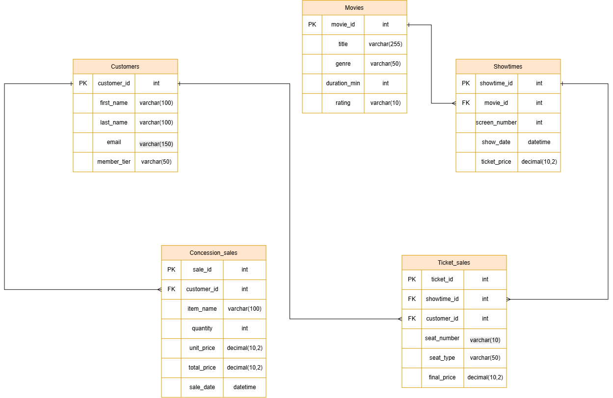

# Operational Database (OLTP) ER Diagram

เอกสารนี้อธิบายสถาปัตยกรรมและโครงสร้างความสัมพันธ์ของฐานข้อมูลต้นทาง (OLTP) สำหรับระบบโรงภาพยนตร์ ซึ่งประกอบด้วยตารางข้อมูลหลักทั้งหมด 5 ตาราง

---

## 1. แผนภาพ ER Diagram ต้นทาง

---

## 2. อธิบายความสัมพันธ์ระหว่างตาราง (Entity Relationships)

* **MOVIES (1) -> (N) SHOWTIMES**
  * ภาพยนตร์ 1 เรื่อง สามารถจัดรอบฉายได้หลายรอบและหลายช่วงเวลา โดยตาราง `showtimes` ใช้ `movie_id` เป็น Foreign Key (FK) อ้างอิงกลับมายังภาพยนตร์

* **SHOWTIMES (1) -> (N) TICKET_SALES**
  * รอบฉายภาพยนตร์ 1 รอบ สามารถขายตั๋วให้ลูกค้าได้หลายที่นั่ง โดยตาราง `ticket_sales` ใช้ `showtime_id` เป็น Foreign Key (FK) อ้างอิงกลับมายังรอบฉาย

* **CUSTOMERS (1) -> (N) TICKET_SALES**
  * ลูกค้า 1 คน สามารถทำรายการซื้อตั๋วภาพยนตร์ได้หลายครั้ง/หลายใบ โดยตาราง `ticket_sales` ใช้ `customer_id` เป็น Foreign Key (FK) ในการอ้างอิงกลับมายังลูกค้า

* **CUSTOMERS (1) -> (N) CONCESSION_SALES**
  * ลูกค้า 1 คน สามารถซื้อสินค้าป๊อปคอร์นและเครื่องดื่มได้หลายรายการ โดยตาราง `concession_sales` ใช้ `customer_id` เป็น Foreign Key (FK) อ้างอิงกลับมายังลูกค้า
