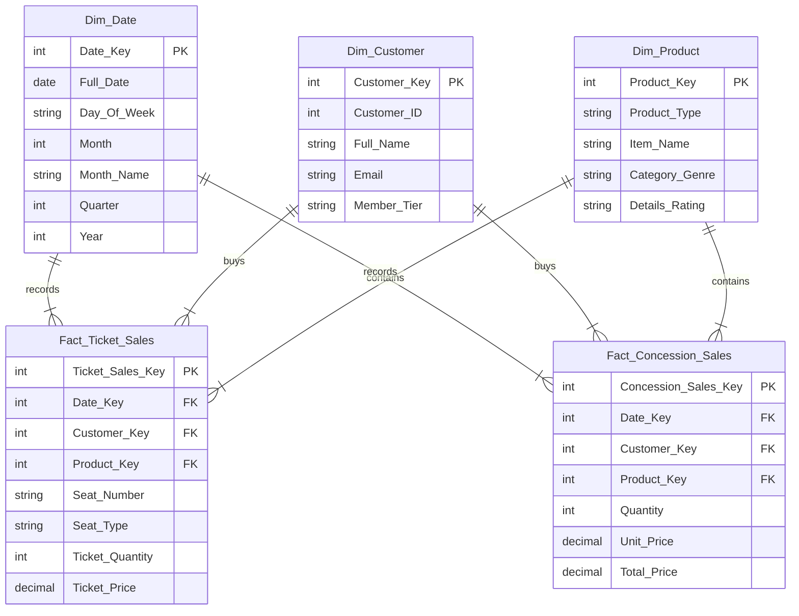

# Multidimensional Data Model Design (Cinema Data Warehouse)

## 1. Grain Description (ระดับความละเอียดของข้อมูล)
* **Fact Ticket Sales:** 1 แถว ต่อ 1 รายการการขายตั๋วชมภาพยนตร์ (Ticket Transaction Item)
* **Fact Concession Sales:** 1 แถว ต่อ 1 รายการสั่งซื้อสินค้าหน้าโรง (Concession Sale Item)

## 2. Dimension Tables & Hierarchies (ตารางมิติและระดับชั้น)

### 2.1 Dim_Customer (มิติด้านลูกค้า)
* **Attributes:** Customer_ID, Customer_ID, Full_Name, Email, Member_Tier
* **Hierarchy:** Member_Tier -> Customer_ID

### 2.2 Dim_Movie (มิติด้านภาพยนตร์)
* **Attributes:** Movie_ID, Movie_ID, Title, Genre, Duration_Min, Rating
* **Hierarchy:** Genre -> Title

### 2.3 Dim_Showtime (มิติด้านรอบฉาย)
* **Attributes:** Showtime_Key, Showtime_ID, Screen_Number, Time_Slot (Morning, Afternoon, Evening, Night)

---

## 3. Fact Tables & Measures (ตารางข้อเท็จจริงและตัววัด)

### 3.1 Fact_Ticket_Sales (Star Schema)
* **Foreign Keys:**
  * `Date_Key` (FK -> Dim_Date)
  * `Customer_Key` (FK -> Dim_Customer)
  * `Movie_Key` (FK -> Dim_Movie)
  * `Showtime_Key` (FK -> Dim_Showtime)
* **Degenerate Dimensions / Attributes:**
  * `Seat_Number`
  * `Seat_Type` (Normal, Honeymoon, VIP)
* **Measures:**
  * `Ticket_Quantity` (Additive: Count = 1)
  * `Ticket_Price` (Additive)

### 3.2 Fact_Concession_Sales (Star Schema)
* **Foreign Keys:**
  * `Date_Key` (FK -> Dim_Date)
  * `Customer_Key` (FK -> Dim_Customer)
  * `Item_Key` (FK -> Dim_Concession_Item)
* **Measures:**
  * `Quantity` (Additive)
  * `Unit_Price` (Non-additive)
  * `Total_Price` (Additive)

---

## 4. Star Schema Diagram

